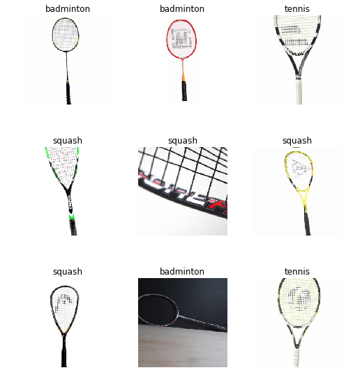
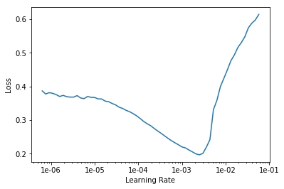
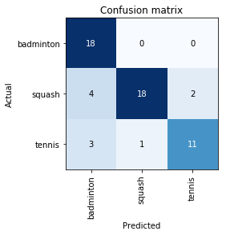
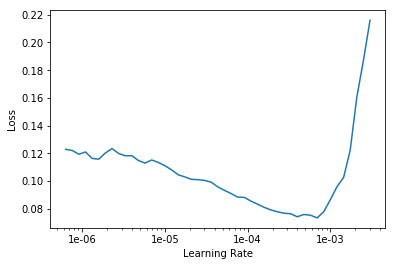

# Racket Classifier

Tennis and squash rackets look very similar so thought this would be an interesting first project from the DL for coders course. Learnt a lot doing 


```python
from fastai.vision import *
```


```python
folders = ['tennis', 'squash', 'badminton']
classes = folders # classes are same as the folder names
files = ['tennis.txt', 'squash.txt', 'badminton.txt']
```


```python
# Download the images of the different rackets

path = Path('data/rackets')

for folder in folders:
    dest = path/folder
    dest.mkdir(parents = True, exist_ok = True)
```


```python
classes = folders 
for ind, file in enumerate(files):
    dest = path/folders[ind]
    download_images(dest/file, dest, max_pics = 100)
```


```python
for c in classes:
    print(c)
    verify_images(path/c, delete=True, max_size=500)
```


```python
# crop the images to the right size and partition a train and val set
np.random.seed(42)
data = ImageDataBunch.from_folder(path, train=".", valid_pct=0.2,
        ds_tfms=get_transforms(), size=224, num_workers=4).normalize(imagenet_stats)
```


```python
data.classes
```


    ['badminton', 'squash', 'tennis']


```python
data.show_batch(rows=3, figsize = (7,8)) # show some of the figs
```





```python
len(data.train_ds), len(data.valid_ds) # print the number of 
```


    (232, 57)


### Train the Model


```python
learn = cnn_learner(data, models.resnet34, metrics=error_rate)
```


```python
learn.fit_one_cycle(4)
```


<table border="1" class="dataframe">
  <thead>
    <tr style="text-align: left;">
      <th>epoch</th>
      <th>train_loss</th>
      <th>valid_loss</th>
      <th>error_rate</th>
      <th>time</th>
    </tr>
  </thead>
  <tbody>
    <tr>
      <td>0</td>
      <td>1.503866</td>
      <td>1.209995</td>
      <td>0.596491</td>
      <td>00:04</td>
    </tr>
    <tr>
      <td>1</td>
      <td>1.094633</td>
      <td>0.633820</td>
      <td>0.315789</td>
      <td>00:03</td>
    </tr>
    <tr>
      <td>2</td>
      <td>0.880071</td>
      <td>0.490036</td>
      <td>0.210526</td>
      <td>00:03</td>
    </tr>
    <tr>
      <td>3</td>
      <td>0.749981</td>
      <td>0.518253</td>
      <td>0.210526</td>
      <td>00:03</td>
    </tr>
  </tbody>
</table>


```python
learn.save('stage-1')
```

After 4 epochs getting around 79% accuracy but can see the train loss is higher than the validation loss which is a sign that we are either not training long enough or that the learning rate is too small....


```python
learn.load('stage-1');
```


```python
learn.unfreeze()
```


```python
learn.lr_find()
```


    LR Finder is complete, type {learner_name}.recorder.plot() to see the graph.


```python
learn.recorder.plot()
```





```python
learn.fit_one_cycle(2, max_lr = slice(3e-4,1e-3))
```


<table border="1" class="dataframe">
  <thead>
    <tr style="text-align: left;">
      <th>epoch</th>
      <th>train_loss</th>
      <th>valid_loss</th>
      <th>error_rate</th>
      <th>time</th>
    </tr>
  </thead>
  <tbody>
    <tr>
      <td>0</td>
      <td>0.289872</td>
      <td>1.035483</td>
      <td>0.228070</td>
      <td>00:03</td>
    </tr>
    <tr>
      <td>1</td>
      <td>0.267291</td>
      <td>0.662869</td>
      <td>0.175439</td>
      <td>00:03</td>
    </tr>
  </tbody>
</table>


Can see that now having updated the learning rates getting around 83% accuracy


```python
learn.save('stage-2')
```

### Interpretting results


```python
learn.load('stage-2'); # ; suppresses the output
```


```python
interp = ClassificationInterpretation.from_learner(learn)
```


```python
interp.plot_confusion_matrix()
```





Can see that the main cause of error is badminton rackets being predicted when they are actually tennis and squash rackets. This is a bit weird as i'd say that badminton rackets are a bit more unique than squash and tennis rackets..

### Cleaning up the data a bit better


```python
from fastai.widgets import *
```


```python
# Make a copy of the images but without the train val split so can clean the whole dataset
db = (ImageList.from_folder(path)
                   .split_none()
                   .label_from_folder()
                   .transform(get_transforms(), size=224)
                   .databunch()
     )
```


```python
# Create new learner to use the new databunch without the split
learn_cln = cnn_learner(db, models.resnet34, metrics=error_rate)
learn_cln.load('stage-2');
```


```python
ds, idxs = DatasetFormatter().from_toplosses(learn_cln) # Find the top losses
```


```python
ImageCleaner(ds, idxs, path) # Run the image cleaning widget
```


    HBox(children=(VBox(children=(Image(value=b'\xff\xd8\xff\xe0\x00\x10JFIF\x00\x01\x01\x01\x00d\x00d\x00\x00\xff…


    Button(button_style='primary', description='Next Batch', layout=Layout(width='auto'), style=ButtonStyle())


```python
np.random.seed(42)
data = ImageDataBunch.from_csv(path, folder=".", valid_pct=0.2, csv_labels="cleaned.csv", ds_tfms=get_transforms(), size=224, num_workers=4)

# create new dataset from the cleaned images and repartition
```


```python
learn_final = cnn_learner(data, models.resnet34, metrics=error_rate)
learn_final.load('stage-2');

# Create new network and load the old weights before the clean
```


```python
learn_final.fit_one_cycle(4)
```


<table border="1" class="dataframe">
  <thead>
    <tr style="text-align: left;">
      <th>epoch</th>
      <th>train_loss</th>
      <th>valid_loss</th>
      <th>error_rate</th>
      <th>time</th>
    </tr>
  </thead>
  <tbody>
    <tr>
      <td>0</td>
      <td>0.299954</td>
      <td>0.197074</td>
      <td>0.090909</td>
      <td>00:03</td>
    </tr>
    <tr>
      <td>1</td>
      <td>0.229090</td>
      <td>0.192606</td>
      <td>0.054545</td>
      <td>00:03</td>
    </tr>
    <tr>
      <td>2</td>
      <td>0.198670</td>
      <td>0.213305</td>
      <td>0.090909</td>
      <td>00:03</td>
    </tr>
    <tr>
      <td>3</td>
      <td>0.182369</td>
      <td>0.216824</td>
      <td>0.054545</td>
      <td>00:03</td>
    </tr>
  </tbody>
</table>


Nice! So can see with the cleaned data the error rate has decreased massively. Lets save that then do LR finder again to see if we can get any better... 


```python
learn_final.save('Stage-3')
```


```python
learn_final.load('Stage-3');
learn_final.unfreeze()
```


```python
learn_final.lr_find()
```


    LR Finder is complete, type {learner_name}.recorder.plot() to see the graph.


```python
learn_final.recorder.plot()
```





```python
learn_final.fit_one_cycle(4, max_lr = slice(5e-5,4e-4))
```


<table border="1" class="dataframe">
  <thead>
    <tr style="text-align: left;">
      <th>epoch</th>
      <th>train_loss</th>
      <th>valid_loss</th>
      <th>error_rate</th>
      <th>time</th>
    </tr>
  </thead>
  <tbody>
    <tr>
      <td>0</td>
      <td>0.085460</td>
      <td>0.228255</td>
      <td>0.072727</td>
      <td>00:03</td>
    </tr>
    <tr>
      <td>1</td>
      <td>0.111426</td>
      <td>0.163805</td>
      <td>0.054545</td>
      <td>00:03</td>
    </tr>
    <tr>
      <td>2</td>
      <td>0.087593</td>
      <td>0.111992</td>
      <td>0.036364</td>
      <td>00:03</td>
    </tr>
    <tr>
      <td>3</td>
      <td>0.075449</td>
      <td>0.096824</td>
      <td>0.036364</td>
      <td>00:03</td>
    </tr>
  </tbody>
</table>


Nice so changing the learning rate to make it more granular we are getting 96% accuracy! Lets save those weights! 


```python
learn_final.save('Final')
```

### Testing 


```python
learn_final.load('Final');
```


```python
learn_final.export()
```


```python
defaults.device = torch.device('cpu')
```


```python
test = ['test1.jpg', 'test2.jpg'] # test1 = tennis, test2 = badminton
mod = load_learner(path)
```


```python
test1 = open_image(path/test[0])
test1
```


```python
test2 = open_image(path/test[1])
test2
```


```python
preds = []
for im in test:
    img = open_image(path/im)
    pred_class,pred_idx,outputs = mod.predict(img)
    preds.append(pred_class)
```


```python
preds
```


    [Category tennis, Category badminton]


Well bloody hell it works 
